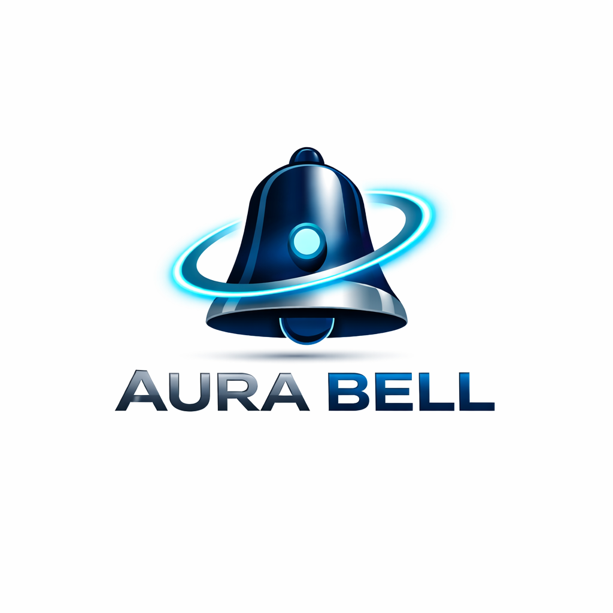

# 🔔 Aura Bell / Dori-Bell Repository

  

  
  
  
  
  
  

---

This repository contains two versions of the serverless smart doorbell system:

## 📂 Repository Structure

| Folder | Version | Description |
| :--- | :--- | :--- |
| [**`original/`**](./original) | **Dori-Bell v1.0** | The initial serverless template. Simple, secure, and notifies via Telegram. |
| [**`upgraded/`**](./upgraded) | **Aura Bell v2.0** | The professional upgraded version with multi-lingual support, direct calling, and a setup UI. |

---

## 🚀 Quick Start

To get started, choose the version you want to deploy and follow the instructions in its respective `README.md` file.

- For the **Original Dori-Bell**, go to [original/README.md](./original/README.md).
- For the **Upgraded Aura Bell**, go to [upgraded/README.md](./upgraded/README.md).

---

## 🛠️ Features Comparison

| Feature | Original (Dori-Bell) | Upgraded (Aura Bell) |
| :--- | :---: | :---: |
| Serverless (Cloudflare Workers) | ✅ | ✅ |
| Telegram Notifications | ✅ | ✅ |
| Bot Protection (Turnstile) | ✅ | ✅ |
| Multi-lingual Support | ❌ | ✅ (5 Languages) |
| Direct Calling | ❌ | ✅ |
| Setup UI / Script | ❌ | ✅ |
| Professional Branding | ❌ | ✅ |

---

  Built with ❤️ for the Smart Home Community

